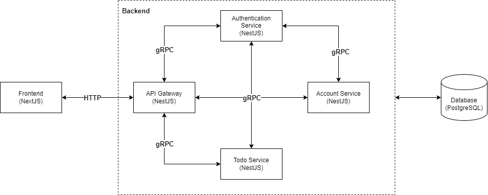

# bTodo main

---

## System design overview



---

## Install dependency

Run command on bash

```bash
bash INSTALL.sh
```

## Run docker file

```bash
docker compose up -d
```

---

## Resources

- [bTodo database](https://github.com/Babyze/btodo-database): bTodo database repository

- [bTodo Authentication service](https://github.com/Babyze/btodo-auth): bTodo Authentication service repository

- [bTodo Todo service](https://github.com/Babyze/btodo-todo): bTodo Todo service repository

- [bTodo Account service](https://github.com/Babyze/btodo-account): bTodo Account service repository

- [bTodo API Gateway](https://github.com/Babyze/btodo-api-gateway): bTodo API Gateway repository

- [bTodo Frontend](https://github.com/Babyze/btodo-fe): bTodo frontend repository

- [bTodo Proto Buffer](https://github.com/Babyze/btodo-proto): Proto buffer definition repository
